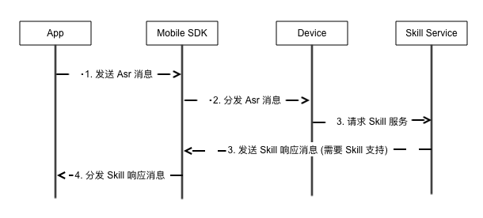

# Vui 模块

## 流程



## 发送ASR 

发送 ASR，就是发送 指定，让设备根据指令进行操作。

**参数说明**
 
| 字段    | 类型   | 必须？| 说明 |
| ------ | ----- | ----- | ----- |
| deviceId | String | 是 | 设备Id  |
| asr | String | 是 | 你对设备说的话  |

**示例代码**：
 
Java:
 
```java
RokidMobileSDK.vui.sendAsr(deviceId, asr, new IChannelPublishCallback() {
    @Override
    public void onSucceed() {
        // TODO
    }

    @Override
    public void onFailed() {
        // TODO
    }

});
```
 
Kotlin:
 
```kotlin
RokidMobileSDK.vui.sendAsr(deviceId, asr, object : IChannelPublishCallback {
    override fun onSucceed() {
        // TODO
    }

    override fun onFailed() {
     // TODO
    }

})
```
 
**返回参数说明**
 
| 字段    | 类型    | 说明 |
| ------ | ------- |  ----- |
|sendSuccess| boolean|是否发送成功|

---

## 创建 ASR 纠错

纠正设备错误识别的 ASR 内容。

**参数说明**
 
| 字段    | 类型   | 必须？| 说明 |
| ------ | ----- | ----- | ----- |
| originText | String | 是 | 原始的 ASR 内容  |
| targetText | String | 是 | 纠正后的 ASR 内容  |

**示例代码**：
 
```java
RokidMobileSDK.vui.asrCorrectCreate(originText,
                targetText,
                new IGetAsrErrorCallback() {
                    @Override
                    public void onGetAsrErrorSucceed(AsrErrorCorrectBean asrErrorCorrectBean) {
                        //do something
                    }

                    @Override
                    public void onGetAsrErrorFailed(String errorCode, String errorMsg) {
                        //do something
                    }
                });
```
 
 **asrErrorCorrectBean数据格式**：
   
 ```json
[
    {
        // ASR纠错ID
        "id": "xxx",   
        // 用户ID          
        "accountId": "xxx", 
        // 原始的ASR内容
        "originText": "xxx" ,
        // 纠正后的ASR内容
        "targetText": "xxx" ,
        // ASR纠错的创建时间
        "createTime": "xxx" ,
        // ASR纠错的更新时间
        "updateTime": "xxx" ,
    }
]
 ```
 
 ---

## 查询 ASR 纠错 

查询这条 ASR 是否被纠错过。

**参数说明**
 
| 字段    | 类型   | 必须？| 说明 |
| ------ | ----- | ----- | ----- |
| originText | String | 是 | 原始的 ASR 内容  |

**示例代码**：
 
```java
RokidMobileSDK.vui.asrCorrectFind(originText, new IGetAsrErrorCallback() {
            @Override
            public void onGetAsrErrorSucceed(AsrErrorCorrectBean asrErrorCorrectBean) {
                //do something
            }

            @Override
            public void onGetAsrErrorFailed(String errorCode, String errorMsg) {
                //do something
            }
        });
```

---

## 更新 ASR 纠错 

修改该条 ASR 的纠错内容。

**参数说明**
 
| 字段    | 类型   | 必须？| 说明 |
| ------ | ----- | ----- | ----- |
| asrId | long | 是 | ASR纠错ID  |
| originText | String | 是 | 原始的 ASR 内容  |
| targetText | String | 是 | 纠正后的 ASR 内容  |

**示例代码**：
 
```java
RokidMobileSDK.vui.asrCorrectUpdate(asrId,
                originText,
                targetText,
                new IGetAsrErrorManageCallback() {
                    @Override
                    public void onGetAsrErrorManageListSucceed() {
                        //do something
                    }

                    @Override
                    public void onGetAsrErrorManageFailed(String errorCode, String errorMsg) {
                        //do something
                    }
                });
```

---

## 删除 ASR 纠错 

删除该条 ASR 的纠错内容。

**参数说明**
 
| 字段    | 类型   | 必须？| 说明 |
| ------ | ----- | ----- | ----- |
| asrId | long | 是 | ASR纠错ID  |

**示例代码**：
 
```java
RokidMobileSDK.vui.asrCorrectDelete(asrId, new IGetAsrErrorManageCallback() {
            @Override
            public void onGetAsrErrorManageListSucceed() {
                //do something
            }

            @Override
            public void onGetAsrErrorManageFailed(String errorCode, String errorMsg) {
                //do something
            }
        });
        
```

---

## 获取 ASR 纠错历史列表 

获取该用户全部的 ASR 纠错内容。

**参数说明**
 
| 字段    | 类型   | 必须？| 说明 |
| ------ | ----- | ----- | ----- |
| pageNumber | int | 是 | 页码  |
| pageSize | int | 是 | 每页显示的数量  |

**示例代码**：
 
```java
RokidMobileSDK.vui.asrCorrectHistory(pageNumber, 
                pageSize, 
                new IGetAsrErrorListCallback() {
            @Override
            public void onGetAsrErrorListSucceed(List<AsrErrorCorrectBean> list) {
                //do something
            }

            @Override
            public void onGetAsrErrorListFailed(String errorCode, String errorMsg) {
                //do something
            }
        });
        
```

---


